

 

<h1 align="center">DDDForum.com</h1>

## About

In this document we will document how the issues given to our team in the part 1 of our project were solved.

## Documentation

### 1 - Build Automation using Node.js scripts

In this issue, we wanted to automate the installation of the necessary modules to run our application using the "npm install" command and build the same application using the "npm run-script" command.

To achieve the desired result, a Node.js script was created with the name "installDependenciesAndBuild.js." This script contains a function called "runCommand," which takes the command and its success message as parameters. In case of an error, this script also displays the errors.

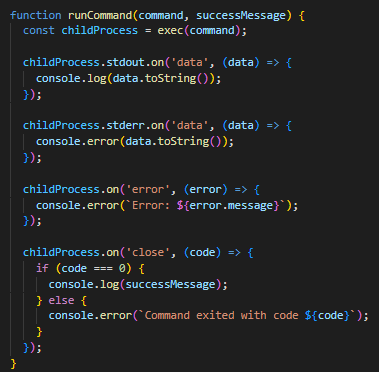

We can see that the function is called with the previously mentioned commands.

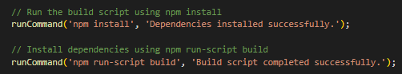

After completing the production of this script, the automation of it is not yet finalized. To accomplish this, we created a new script in the "package.json" file that runs the created Node.js script, and we created a task using Gradle to execute it.

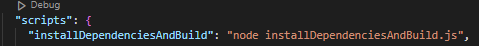

This task, named "installDependenciesAndBuild" (type: Exec), will be used in Gradle to automate the entire process in the pipeline.

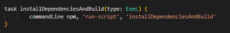

We created the String variable "npm" as follows: "npm = os.isLinux() ? 'npm' : 'npm.cmd'". This is because we noticed that the "npm" command in a Gradle task on Windows only works when accompanied by ".cmd."

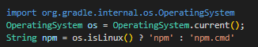

After applying all the referenced changes to our master branch, we go to Jenkins and configure our new task within the job steps.

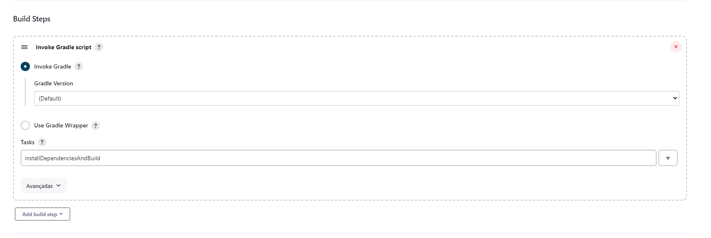

As we can see, the build was successful!

### 3 - JSDoc generation

In this issue, it was asked to generate JSDoc files.
This issue was divided in 3 parts. First, we needed to check and try to build JSDoc using node and npm.

In order to the step mentioned before, first we needed to install JSDoc using the npm. To do that, the JSDoc was installed has a dev-dependency using the command

> npm install -D jsdoc

After that, a file with the name jsdoc.json was created. This file is a configuration file, that allows the program to know how JSDoc is supposed to run

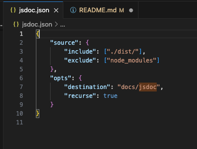

After doing an npm install/running the program for the first time, a folder called dist will be created. This folder will contain all the compiled JavaScript files.
We need to look for this folder because JSDoc isn't compatible with Typescript.
As such, our source include needs to be the dist folder and we need to ignore the node_modules folder, because we don't want to generate JSDoc from our dependencies.
The destination setting is where our generated documents will be placed and the recurse being valued at true means that will search for all the subdirectories of the source include.

After that we needed to build automation using Gradle and create a task that generates all JSDoc documentation for the project.
In order to do that a task was created inside the build.gradle file.

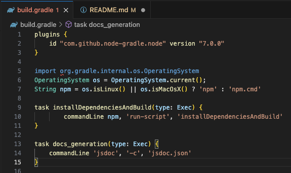

This task will execute JSDoc with the configured jsdoc.json file.
After finishing the task there will be created a folder named jsdoc inside the docs folder.
Inside the jsdoc foler, there will be an index.html file. If you open it using a browser, you will see that that's where the documentation will be.

This task was also tested in Jenkins. In order to use it, first we need to run the task installDependenciensAndBuild.

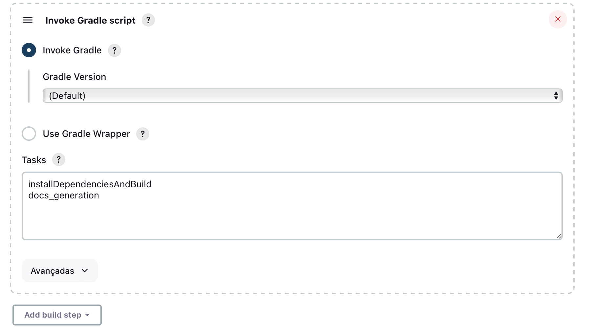

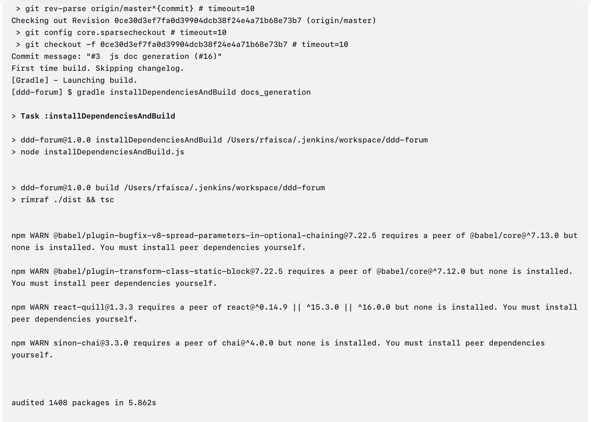

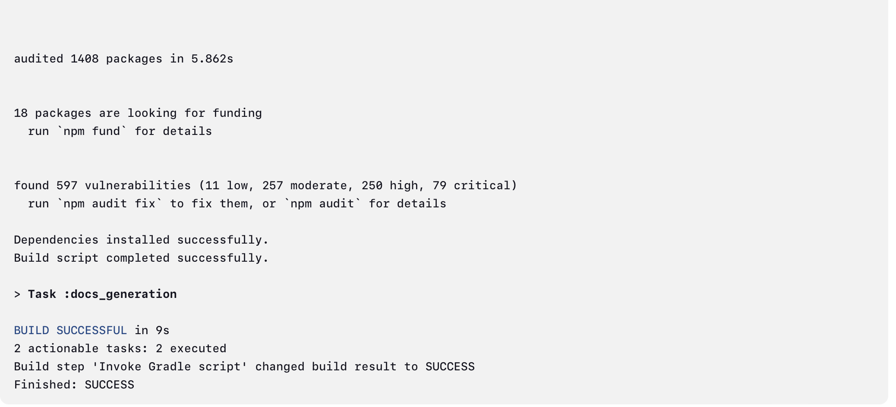

As you can see the task, ran without issues and by opening the workspace in jenkins, we can see that the jsdoc folder was created.

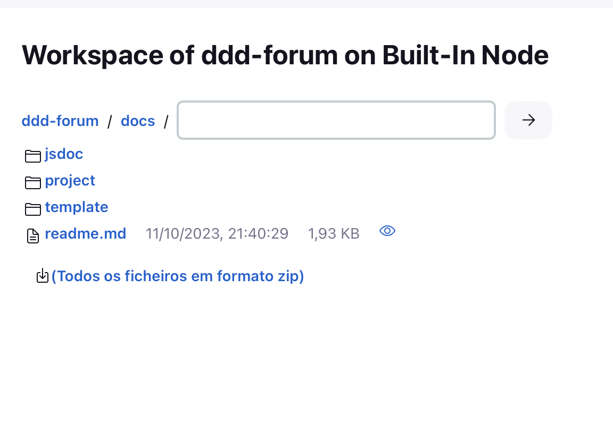

### 8 - New Posts Listing

In this issue, it was asked to change the background color of today's Posts and that Posts should show the number of first level comments and not the number of all comments.

For the first part of the issue, the file PostMeta.tsx was changed and it was added an inline css style class.

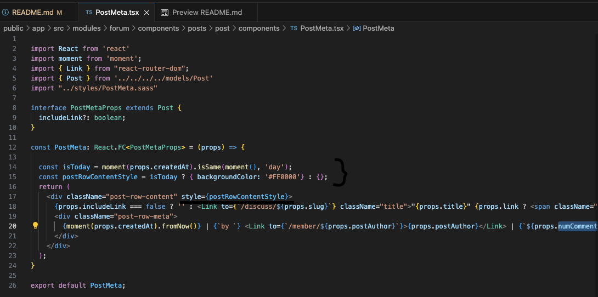

Now today's Posts look like this.

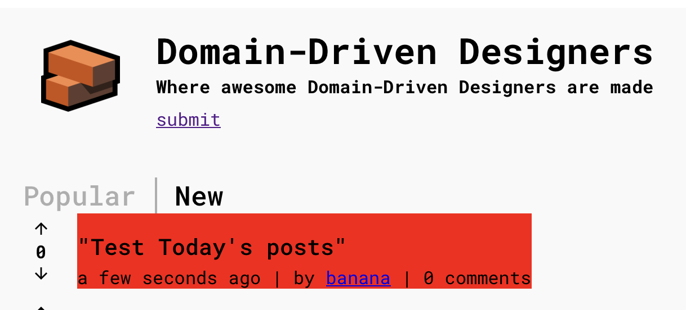

For the second part of the issue, the file sequelizePostRepo.ts was changed.
The query used to get the number of comments was considering all comments and not only the first level comments.
In order to fix this issue, it was added in the query that the parent_comment_id also had to be null on the comment table, because if the parent_comment_id is null it means that it was a direct comment to a Post and not to a comment.

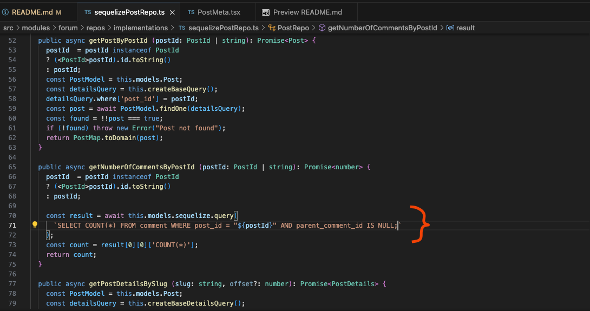

This was the result.

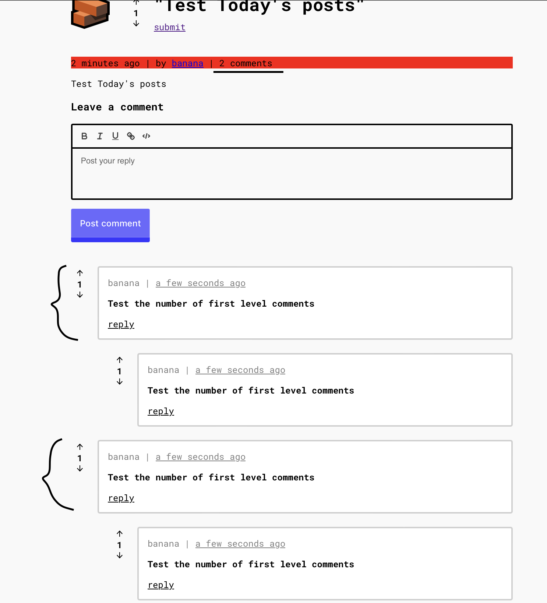

