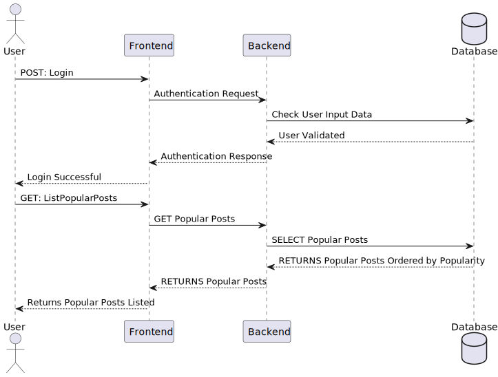

# US 003 - Create a PlantUML sequence diagram for the "List Popular Post" requirement

## 1. Requirements Engineering

### 1.1. User Story Description

As an organization employee, I want to create a new PlantUML sequence diagram related to the "List Popular Post" feature.

### 1.2. Customer Specifications and Clarifications

**From the specifications document:**

No customer specifications, as this is an increment for a feature that's already implemented in the solution.

### 1.3. Acceptance Criteria

* **AC1:** The diagram to produce must be a sequence diagram.
* **AC2:** It must explain what's the process behind the "List Popular Post" feature.
* **AC3:** A final SVG must be generated from the PlantUML diagram produced.

### 1.4. Found out Dependencies

* There's no dependencies on this task.

### 1.5 Input and Output Data

**Input Data:**

* PlantUML code to produce the diagram.

**Output Data:**

* PlantUML diagram in .puml
* Same representation on the diagram in .svg

### 1.6. Sequence Diagram (SD)

**List Popular Post Diagram.**

### 1.7 Other Relevant Remarks

* No relevant remarks.
